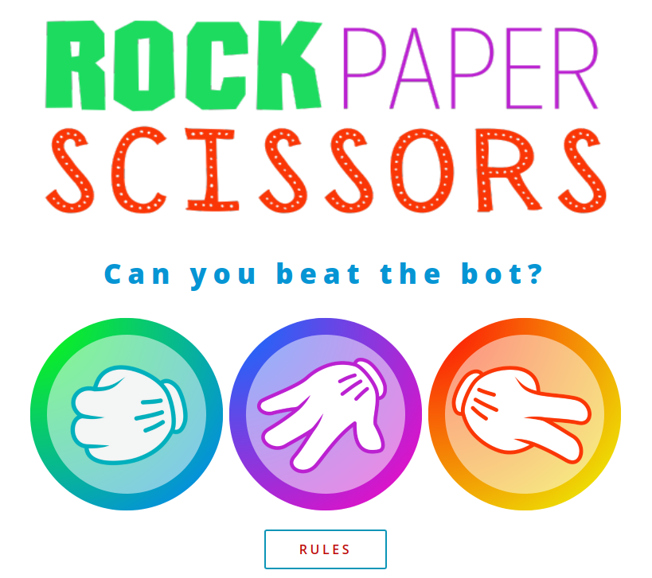
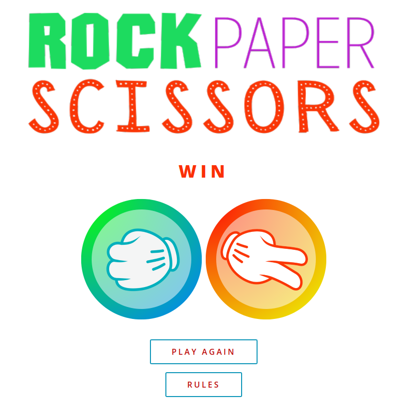

# Beat the Bot - Rock Paper Scissors Game

This is a simple implementation of the classic game "Rock Paper Scissors" using HTML, CSS, and JavaScript.

# Getting Started

To play the game, simply open the index.html file in your web browser. You should see a screen with three buttons: "Rock", "Paper", and "Scissors". Click one of the buttons to make your choice, and the computer will randomly choose its own move. The game will then determine the winner and display the results on the screen.

# Prerequisites

You will need a web browser to run this game. The game has been tested on the following browsers:

Google Chrome
Mozilla Firefox
Microsoft Edge

# Built With

This game was built using the following technologies:

HTML
CSS
JavaScript

# Authors

This game was created by Arriann Lee.

## Screenshots

